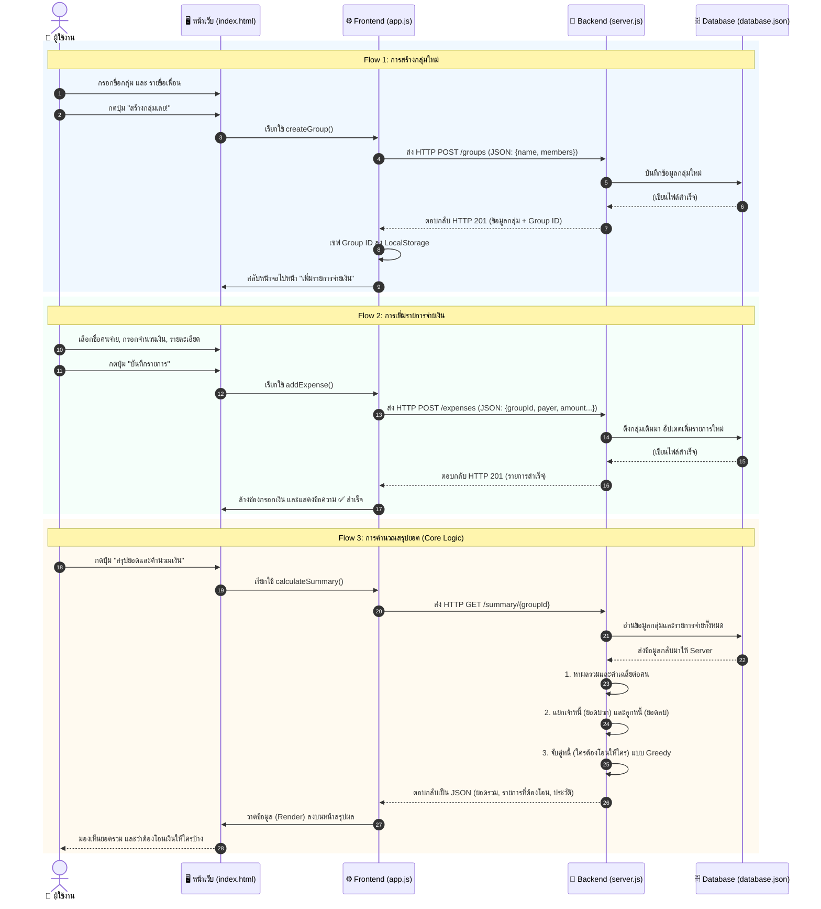

# 🔄 เส้นทางการไหลของข้อมูล (Data Flow) โปรเจกต์ HarnNgeinHub

การทำงานของแอปพลิเคชันนี้จะเป็นรูปแบบ **Client-Server Architecture** โดยมี `app.js` เป็นตัวกลางฝั่งผู้ใช้ (Client) และ `server.js` เป็นคนคิดคำนวณและเก็บข้อมูล (Server)

ด้านล่างนี้คือแผนภาพ **Sequence Diagram** สรุปการเดินของข้อมูลตั้งแต่ผู้ใช้กดปุ่ม จนถึงการประมวลผลและการจัดเก็บ

## อธิบายจังหวะสำคัญของการไหลของข้อมูล:

1. **ฝั่งผู้ใช้ (Frontend) -> รับและแพ็กข้อมูล:** 
   เมื่อผู้ใช้พิมพ์ข้อมูลและกดปุ่ม หน้า `index.html` จะสะกิด `app.js` ให้รวบรวมข้อมูลเหล่านั้น แพ็กใส่กล่องในรูปแบบ `JSON` แล้วยิงส่งไปหาหลังบ้าน (Backend) ผ่านคำสั่ง `fetch()`
2. **ฝั่งหลังบ้าน (Backend) -> คิดและเก็บข้อมูล:**
   เมื่อ `server.js` ได้รับแพ็กเกจข้อมูลมา จะเอามาแกะดู ถ้าเป็นคำสั่งให้เก็บ ก็จะแปลงข้อมูลเขียนลงไฟล์ `database.json` ทันที แต่ถ้าเป็นคำสั่งให้คำนวณสรุปยอด มันจะไปกวาดข้อมูลจาก `database.json` มานั่งบวกลบคูณหาร จับคู่คนที่ต้องโอนเงินให้กันจนเสร็จ
3. **ส่งกลับและแสดงผล (Render):**
   `server.js` ส่งผลลัพธ์การคำนวณที่เสร็จเรียบร้อย (ในรูป JSON) กลับไปหา `app.js` จากนั้น `app.js` จะทำหน้าที่เอาข้อมูลดิบนี้ ไปแทรกลงในโครง `index.html` เพื่อให้หน้าจอแสดงผลออกมาสวยงามให้ผู้ใช้อ่านได้ครับ
